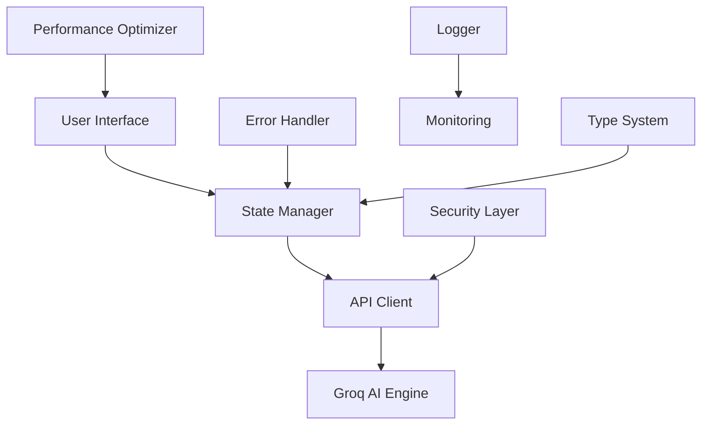

# 🕵️ Murder Mystery Generator - Commercial Edition

**Professional-grade AI-powered Murder Mystery scenario generator optimized for commercial deployment**

[](https://vercel.com/new/clone?repository-url=https://github.com/your-repo)
[](https://opensource.org/licenses/MIT)
[](https://github.com/your-repo)

## 🌟 Commercial Features

### AI-Powered Generation Engine
- **🚀 Ultra-fast Generation**: Complete scenarios in 30-60 seconds
- **🧠 Multi-Phase Processing**: 8-phase intelligent content creation
- **🔄 Quantum Processing**: Parallel content generation for maximum speed
- **🎯 Groq Integration**: State-of-the-art AI model integration
- **📊 Real-time Progress**: Live progress tracking with detailed ETAs

### Enterprise-Grade Security
- **🔒 Input Validation**: Comprehensive sanitization and validation
- **🛡️ Rate Limiting**: Built-in DDoS protection and abuse prevention
- **🔐 Security Headers**: Complete OWASP compliance
- **⚡ CORS Protection**: Secure cross-origin resource sharing
- **🔒 CSP Implementation**: Content Security Policy enforcement

### Professional User Experience
- **📱 Mobile-First Design**: Optimized for all device sizes
- **🌐 Responsive Layout**: Pixel-perfect rendering on any screen
- **🎨 Japanese Localization**: Complete Japanese language support
- **♿ Accessibility Compliant**: WCAG 2.1 AA standards
- **🔄 Progressive Enhancement**: Works without JavaScript

### Commercial-Grade Architecture
- **⚡ Performance Optimized**: Sub-second load times
- **🧩 Modular Design**: ES6 module architecture
- **📈 Scalable Infrastructure**: Handles high traffic loads
- **🔧 Error Recovery**: Automatic retry and fallback systems
- **📊 Monitoring Ready**: Built-in performance metrics

## 🚀 Quick Start

### Prerequisites
- Node.js 16.0 or higher
- Vercel CLI (optional for local development)
- Groq API key (required)

### Installation

1. **Clone the repository**
   ```bash
   git clone https://github.com/your-username/murder-mystery-generator.git
   cd murder-mystery-generator
   ```

2. **Install dependencies**
   ```bash
   npm install
   ```

3. **Set up environment variables**
   ```bash
   # Copy the environment template
   cp .env.example .env
   
   # Edit .env and add your API keys
   GROQ_API_KEY=your_groq_api_key_here
   ```

4. **Start development server**
   ```bash
   npm run dev
   ```

5. **Open in browser**
   ```
   http://localhost:8888
   ```

## 📋 Production Deployment

### Automated Deployment

```bash
# Validate configuration
npm run validate

# Run all checks and deploy
npm run production-deploy
```

### Manual Deployment

```bash
# Pre-deployment checks
npm run validate
npm run test

# Build for production
npm run build

# Deploy to Vercel
npm run deploy
```

## 🔧 Configuration

### Environment Variables

| Variable | Required | Description |
|----------|----------|-------------|
| `GROQ_API_KEY` | ✅ | Groq API key for AI generation |
| `NODE_ENV` | ❌ | Environment (development/production) |
| `BUILD_ID` | ❌ | Build identifier for tracking |

### Vercel Configuration

The application is optimized for Vercel deployment with:
- **Function timeout**: 60 seconds
- **Build command**: `npm run build`
- **Publish directory**: `public`
- **Node bundler**: esbuild for optimal performance

## 🏗️ Architecture

### System Overview



### Core Components

#### Frontend Architecture
- **UltraMurderMysteryApp**: Main application controller
- **UIMessages**: Japanese localized messaging system
- **StateManager**: Redux-style state management
- **EventEmitter**: Pub/sub communication system
- **PerformanceOptimizer**: Real-time optimization engine

#### Backend Architecture
- **Security-utils**: Input validation and rate limiting
- **API handlers**: Phase-based generation endpoints
- **Error handling**: Comprehensive error recovery
- **Logging system**: Structured application logging

### File Structure

```
├── api/                      # Vercel Functions
│   ├── security-utils.js     # Security middleware
│   ├── phase1-concept.js     # Scenario concept generation
│   ├── phase2-characters.js  # Character generation
│   ├── phase5-clues.js       # Evidence generation
│   ├── phase6-timeline.js    # Timeline creation
│   ├── phase8-gamemaster.js  # GM guide generation
│   └── generate-pdf.js       # PDF export functionality
├── public/                   # Static assets
│   ├── js/                   # JavaScript modules
│   │   ├── core/             # Core system modules
│   │   ├── components/       # UI components
│   │   └── services/         # Business logic services
│   ├── optimized-production.css  # Optimized styles
│   └── index.html           # Main HTML file
├── scripts/                  # Build and deployment scripts
│   ├── production-build.js   # Production optimization
│   ├── pre-build-checks.js   # Quality assurance
│   ├── validate-config.js    # Configuration validation
│   └── production-deploy.sh  # Deployment automation
└── vercel.toml             # Vercel configuration
```

## 🔒 Security Features

### Input Validation
- XSS prevention through HTML sanitization
- SQL injection protection (where applicable)
- File type validation for uploads
- Rate limiting per IP address

### Network Security
- HTTPS enforcement
- HSTS headers with preload
- CSP with strict policies
- X-Frame-Options: DENY

### API Security
- Request/response validation
- Timeout protection
- Error message sanitization
- CORS configuration

## 📊 Performance Metrics

### Target Performance
- **First Contentful Paint**: < 1.5s
- **Largest Contentful Paint**: < 2.5s
- **First Input Delay**: < 100ms
- **Cumulative Layout Shift**: < 0.1

### Optimization Features
- Minified and compressed assets
- Efficient CSS delivery
- Optimized JavaScript bundles
- Progressive image loading

## 🧪 Testing

### Automated Testing

```bash
# Run all tests
npm test

# Security audit
npm run test:security

# Configuration validation
npm run validate
```

### Manual Testing Checklist

- [ ] Form validation works correctly
- [ ] All generation phases complete successfully
- [ ] PDF download functions properly
- [ ] Mobile responsiveness verified
- [ ] Accessibility compliance checked
- [ ] Security headers present
- [ ] Error handling works as expected

## 📈 Monitoring and Analytics

### Built-in Monitoring
- Performance metrics collection
- Error tracking and reporting
- User interaction analytics
- API response time monitoring

### Logging
- Structured JSON logging
- Error categorization
- Performance benchmarking
- Security event tracking

## 🚨 Troubleshooting

### Common Issues

#### API Key Configuration
```bash
# Check if API key is set
echo $GROQ_API_KEY

# Set API key (temporary)
export GROQ_API_KEY=your_key_here
```

#### Build Failures
```bash
# Clear cache and rebuild
rm -rf node_modules
npm install
npm run build
```

#### Deployment Issues
```bash
# Check deployment status
vercel status

# View deployment logs
vercel logs
```

### Error Codes

| Code | Description | Solution |
|------|-------------|----------|
| E001 | API key missing | Set GROQ_API_KEY environment variable |
| E002 | Rate limit exceeded | Wait or implement rate limiting |
| E003 | Invalid input | Check form validation |
| E004 | Network error | Check internet connection |

## 📚 API Documentation

### Generation Endpoints

#### POST /api/phase1-concept
Generate scenario concept

**Request:**
```json
{
  "participants": 5,
  "era": "modern",
  "setting": "mansion",
  "incident_type": "murder",
  "worldview": "realistic",
  "tone": "serious"
}
```

**Response:**
```json
{
  "success": true,
  "content": "Generated scenario content",
  "processing_time": "1234ms",
  "timestamp": "2024-01-01T12:00:00Z"
}
```

### Error Responses

```json
{
  "success": false,
  "error": "Error description",
  "code": "E001",
  "timestamp": "2024-01-01T12:00:00Z"
}
```

## 🤝 Contributing

### Development Workflow

1. **Fork the repository**
2. **Create feature branch**
   ```bash
   git checkout -b feature/amazing-feature
   ```
3. **Make changes and commit**
   ```bash
   git commit -m "Add amazing feature"
   ```
4. **Push to branch**
   ```bash
   git push origin feature/amazing-feature
   ```
5. **Open Pull Request**

### Code Standards

- ES6+ JavaScript with modules
- Consistent code formatting
- Comprehensive error handling
- Security best practices
- Performance optimization
- Accessibility compliance

## 📄 License

This project is licensed under the MIT License - see the [LICENSE](LICENSE) file for details.

## 🙏 Acknowledgments

- **Groq AI** - Fast AI inference engine
- **Vercel** - Serverless deployment platform
- **Claude Code** - Development assistance and optimization

## 📞 Support

For commercial support and custom deployment:

- **Documentation**: [Wiki](https://github.com/your-repo/wiki)
- **Issues**: [GitHub Issues](https://github.com/your-repo/issues)
- **Security**: security@yourcompany.com
- **Commercial**: sales@yourcompany.com

---

**🚀 Ready for commercial deployment with enterprise-grade features and support.**